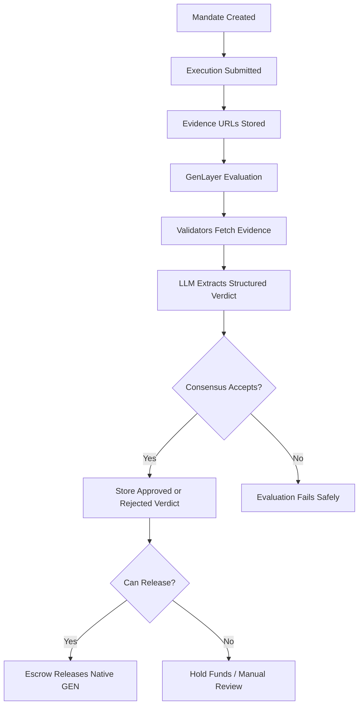

# GEN//OS

GEN//OS is a GenLayer-powered spend governance layer for AI agents, DAO operators, and delegated wallets.

The project lets a user define a natural-language mandate, submit an execution request with public evidence URLs, and have a GenLayer Intelligent Contract evaluate whether escrowed funds should be released, held, or escalated.

In simple terms: GEN//OS is an on-chain operating system for paying work only after evidence proves the work satisfies the policy.

## How It Works

1. A creator writes a mandate in plain English, for example: "Release payment only if public evidence proves the repository was delivered and matches the agreed scope."
2. A vendor or operator submits an execution request with an amount, recipient address, description, and public evidence URLs.
3. The escrow contract accepts native GEN funding for that execution. The funding amount must exactly match the requested execution amount.
4. GenLayer validators fetch the evidence URLs, compare the evidence against the mandate, score risk, and store an approved or rejected verdict on-chain.
5. If approved, the escrow releases native GEN to the execution recipient. If rejected, the funded escrow can be refunded.

This makes the product useful for AI-agent spend control, DAO grants, freelance milestones, public goods payouts, delivery verification, repository reviews, research tasks, content campaigns, and other evidence-based workflows.

## Roles

- Mandate creator: defines the policy, budget, risk threshold, and vault.
- Execution requester: submits a claim that work was completed.
- Recipient/vendor: receives funds if the claim is approved and escrow is released.
- GenLayer validators: independently evaluate public evidence through AI-assisted consensus.
- Escrow contract: holds and releases/refunds native GEN based on the GenOS verdict.

## Why GenLayer

Normal smart contracts are good at deterministic accounting, but weak at interpreting messy real-world work evidence. GEN//OS uses GenLayer for the part that needs judgment:

- Fetch public evidence pages.
- Compare the evidence against a natural-language mandate.
- Score risk from 0 to 4.
- Decide whether the action satisfies the policy.
- Record the result on-chain as an auditable verdict.

## Current Build

- React 19 + Vite + TypeScript frontend.
- Plain CSS custom-property design system, no UI library.
- Custom inline SVG icon system.
- Responsive command-center routes for dashboard, mandates, executions, evidence, audit, and vault.
- GenLayer Intelligent Contract in `contracts/gen_os.py`.
- Live Bradbury reads through `genlayer-js`.
- Browser-wallet signed writes for mandate creation, execution submission, escrow funding, evidence evaluation, and escrow release.
- Native GEN amount model: a `1 GEN` execution requires exactly `1 GEN` escrow funding, then releases or refunds exactly that amount.
- Bradbury-first network configuration.
- Wallet-gated application routes. The landing page is public, while dashboard, mandates, executions, evidence, audit, and vault require a connected Bradbury wallet.

## GenLayer Contracts

Core contract: `GenOS`

Constructor:

```text
admin_address: string
settlement_router: string
```

Write methods:

- `create_mandate(...)`
- `submit_execution(...)`
- `evaluate_execution(execution_id)`
- `admin_pause_mandate(mandate_id, reason)`
- `admin_resume_mandate(mandate_id, reason)`
- `admin_update_settlement_router(settlement_router)`
- `record_settlement(execution_id, settlement_tx)`

Read methods:

- `get_admin()`
- `get_settlement_router()`
- `get_mandate_count()`
- `get_execution_count()`
- `get_mandate(mandate_id)`
- `get_execution(execution_id)`
- `get_execution_amount_wei(execution_id)`
- `get_execution_recipient(execution_id)`
- `get_mandate_executions(mandate_id)`
- `can_release(execution_id)`
- `get_audit_log()`
- `get_full_state()`

Escrow contract: `GenOSEscrow`

Constructor:

```text
admin_address: string
gen_os_address: string
```

Write methods:

- `admin_update_gen_os_address(gen_os_address)`
- `fund_execution(execution_id, recipient_address, note)` payable
- `release_execution(execution_id)`
- `refund_execution(execution_id, reason)`

Read methods:

- `get_admin()`
- `get_gen_os_address()`
- `get_escrow_count()`
- `get_escrow_ids()`
- `get_escrow(execution_id)`
- `can_release(execution_id)`
- `get_totals()`
- `get_escrow_log()`

## Consensus Flow



The contract follows the safe nondeterministic structure we learned from previous submissions:

- Stored mandate and execution data are copied to memory before nondeterministic execution.
- Web fetches and LLM judgment happen inside `gl.vm.run_nondet_unsafe(...)`.
- Validators independently re-run evidence extraction and compare stable fields.
- Storage is mutated only after consensus returns.
- User-facing failures use `gl.vm.UserError`.

## Bradbury Configuration

GenLayer docs currently list Bradbury as the production-like testnet for real AI workloads.

Live Bradbury deployment:

```text
GenOS:       0x9637c249386e4b0b7e66c415Bb1b5619c6a55ce6
GenOSEscrow: 0xA8bc9809120BA45696b0e16F08dC13ff96790449
Admin:       0x35b27B6Fc827De934Fd3E755BcCc0Db5a42e002d
```

Frontend environment:

```text
VITE_GENOS_CONTRACT_ADDRESS=0x9637c249386e4b0b7e66c415Bb1b5619c6a55ce6
VITE_GENOS_ESCROW_ADDRESS=0xA8bc9809120BA45696b0e16F08dC13ff96790449
VITE_GENLAYER_RPC_URL=https://rpc-bradbury.genlayer.com
VITE_GENLAYER_CHAIN_RPC_URL=https://rpc.testnet-chain.genlayer.com
VITE_GENLAYER_CHAIN_ID=4221
```

Never expose a private key through a `VITE_` variable. The frontend uses browser-wallet signing for writes, while deploy keys should stay in local CLI keystores or backend-only environments.

## Local Development

```bash
npm install
npm run dev
```

Production build:

```bash
npm run build
```

Contract validation:

```bash
genvm-lint check contracts/gen_os.py --json
```

Current validation result:

```json
{"ok":true,"lint":{"ok":true,"passed":3},"validate":{"ok":true,"contract":"GenOS","methods":19,"view_methods":12,"write_methods":7,"ctor_params":2}}
{"ok":true,"lint":{"ok":true,"passed":3},"validate":{"ok":true,"contract":"GenOSEscrow","methods":12,"view_methods":8,"write_methods":4,"ctor_params":2}}
```

## Live Test Flow

Use a wallet funded with Bradbury testnet GEN.

1. Open the app and connect a Bradbury wallet.
2. Go to `/mandates/new`.
3. Create a mandate. For a small test, use `1 GEN` max per task and `5 GEN` total budget.
4. Open the created mandate and submit an execution request.
5. Use a recipient address that should receive payment, set amount to `1 GEN`, and include public evidence URLs. Raw GitHub URLs or public documentation pages work best because validators can read the actual content.
6. Open the execution detail page and click `Fund Escrow`. The app funds exactly `1 GEN`.
7. Click `Run GenLayer Evaluation` and wait for the verdict.
8. If approved, click `Release Escrow`. The escrow sends the funded GEN to the recipient and records settlement on GenOS.
9. If rejected, use `Refund Escrow` to return the funded GEN to the depositor.

Bradbury finality can occasionally lag behind the browser transaction waiter. If the evaluation receipt times out or returns an unclear response, the frontend checks `get_execution(...)` directly for up to 30 seconds before showing a hard failure. If a verdict is already stored, GEN-OS refreshes the live state and treats the evaluation as finalized instead of requiring a risky retry.

Expected clean-state behavior after the current deployment: zero mandates, zero executions, and zero escrow totals until a connected wallet creates new live Bradbury data.

## Bradbury Deployment Notes

Use the GenLayer CLI or deploy scripts against Bradbury.

Deploy `GenOS` first:

```bash
genlayer network testnet-bradbury
genlayer deploy --contract contracts/gen_os.py --args "0xYourAdminAddress" "0x0000000000000000000000000000000000000000"
```

Deploy `GenOSEscrow` second, using the deployed `GenOS` address:

```bash
genlayer deploy --contract contracts/gen_os_escrow.py --args "0xYourAdminAddress" "0xDeployedGenOSAddress"
```

Then call `GenOS.admin_update_settlement_router("0xDeployedEscrowAddress")`.

After deployment, set:

```text
VITE_GENOS_CONTRACT_ADDRESS=0x...
VITE_GENOS_ESCROW_ADDRESS=0x...
```

## Frontend Integration

The app now reads accepted state from the deployed Bradbury contracts:

- `get_full_state()`
- `get_mandate(...)`
- `get_execution(...)`
- `get_audit_log()`
- `GenOSEscrow.get_totals()`
- `GenOSEscrow.get_escrow_log()`

Write actions are signed by a connected browser wallet on Bradbury:

- Create a mandate from `/mandates/new`.
- Submit an execution from a mandate detail page.
- Fund native GEN escrow from an execution detail page. The escrow amount is locked to the execution amount.
- Run GenLayer evidence evaluation from an execution detail page.
- Release escrow after a GenOS-approved verdict.
- Refund escrow after a rejected verdict.

If no live mandates exist yet, the dashboard intentionally shows empty Bradbury state rather than pretending mock data is on-chain.
