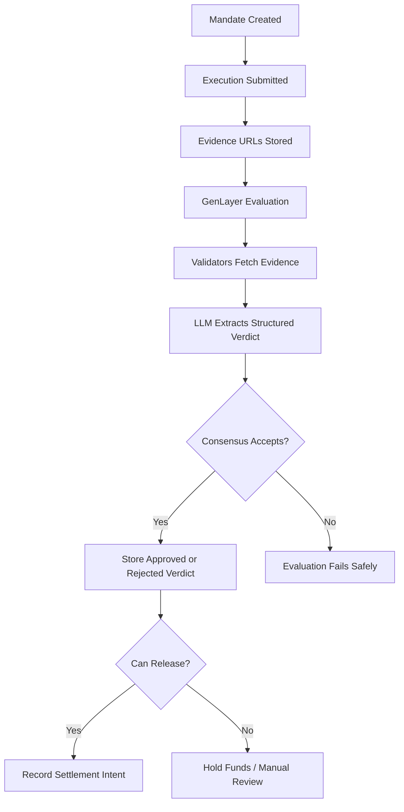

# GEN//OS

GEN//OS is a GenLayer-powered spend governance layer for AI agents, DAO operators, and delegated wallets.

The project lets a user define a natural-language mandate, submit an execution request with public evidence URLs, and have a GenLayer Intelligent Contract evaluate whether escrowed funds should be released, held, or escalated.

## Why GenLayer

Normal smart contracts are good at deterministic accounting, but weak at interpreting messy real-world work evidence. GEN//OS uses GenLayer for the part that needs judgment:

- Fetch public evidence pages.
- Compare the evidence against a natural-language mandate.
- Score risk from 0 to 4.
- Decide whether the action satisfies the policy.
- Record the result on-chain as an auditable verdict.

## Current Build

- React 19 + Vite + TypeScript frontend.
- Plain CSS custom-property design system, no UI library.
- Custom inline SVG icon system.
- Responsive command-center routes for dashboard, mandates, executions, evidence, audit, and vault.
- GenLayer Intelligent Contract in `contracts/gen_os.py`.
- Bradbury-first network configuration.

## GenLayer Contract

Contract: `GenOS`

Constructor:

```text
admin_address: string
settlement_router: string
```

Write methods:

- `create_mandate(...)`
- `submit_execution(...)`
- `evaluate_execution(execution_id)`
- `admin_pause_mandate(mandate_id, reason)`
- `admin_resume_mandate(mandate_id, reason)`
- `record_settlement(execution_id, settlement_tx)`

Read methods:

- `get_admin()`
- `get_settlement_router()`
- `get_mandate_count()`
- `get_execution_count()`
- `get_mandate(mandate_id)`
- `get_execution(execution_id)`
- `get_mandate_executions(mandate_id)`
- `can_release(execution_id)`
- `get_audit_log()`
- `get_full_state()`

## Consensus Flow



The contract follows the safe nondeterministic structure we learned from previous submissions:

- Stored mandate and execution data are copied to memory before nondeterministic execution.
- Web fetches and LLM judgment happen inside `gl.vm.run_nondet_unsafe(...)`.
- Validators independently re-run evidence extraction and compare stable fields.
- Storage is mutated only after consensus returns.
- User-facing failures use `gl.vm.UserError`.

## Bradbury Configuration

GenLayer docs currently list Bradbury as the production-like testnet for real AI workloads.

Frontend environment:

```text
VITE_GENOS_CONTRACT_ADDRESS=
VITE_GENLAYER_RPC_URL=https://rpc-bradbury.genlayer.com
VITE_GENLAYER_CHAIN_RPC_URL=https://rpc.testnet-chain.genlayer.com
VITE_GENLAYER_CHAIN_ID=4221
```

Never expose a private key through a `VITE_` variable. Keep deploy keys in local scripts or backend-only environments.

## Local Development

```bash
npm install
npm run dev
```

Production build:

```bash
npm run build
```

Contract validation:

```bash
genvm-lint check contracts/gen_os.py --json
```

Current validation result:

```json
{"ok":true,"lint":{"ok":true,"passed":3},"validate":{"ok":true,"contract":"GenOS","methods":16,"view_methods":10,"write_methods":6,"ctor_params":2}}
```

## Bradbury Deployment Notes

Use the GenLayer CLI or deploy scripts against Bradbury:

```bash
genlayer network testnet-bradbury
genlayer deploy --contract contracts/gen_os.py --args "0xYourAdminAddress" "0xSettlementRouterOrVaultAddress"
```

After deployment, set:

```text
VITE_GENOS_CONTRACT_ADDRESS=0x...
```

## Product Direction

The MVP UI currently uses realistic local data while the contract is validated and deployment-ready. The next integration step is wiring the frontend read/write layer to the deployed Bradbury contract address, then adding an EVM settlement router so approved GenLayer verdicts can unlock real escrow flows.
